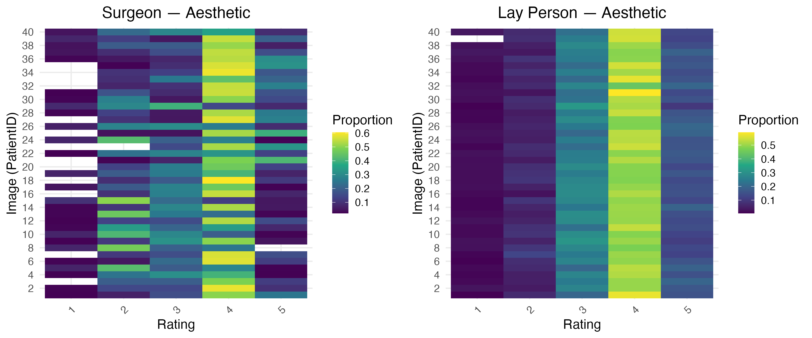
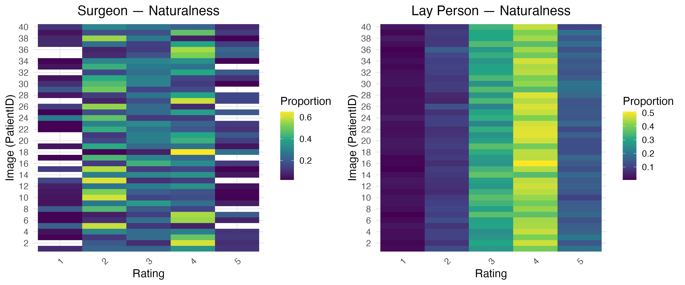
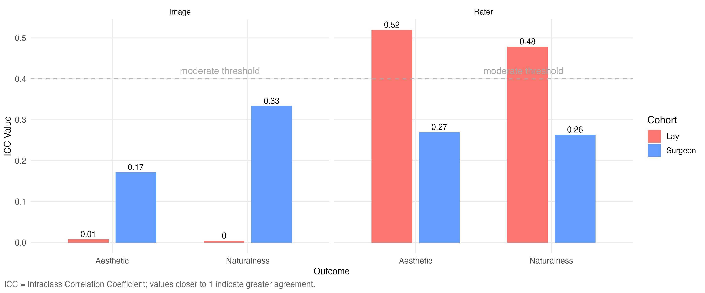
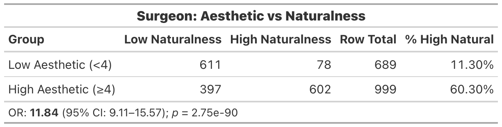
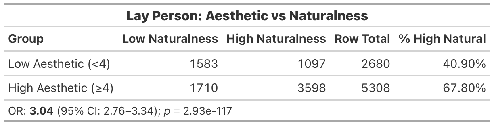

# Quantifying Aesthetic Outcomes in Breast Augmentation
### A Data-Driven Approach to Modeling Vertical Implant Positioning in Postoperative Patient Images

[](https://www.r-project.org/)
[](https://www.sas.com/)
[]()
[](LICENSE)

---

> *"I see statistics as both a science and a service — committed to translating complexity into clarity."*
> — Casandra Serafin, M.S. Biostatistics Candidate, Keck School of Medicine, USC

---

## Overview

There is no universally accepted metric for guiding vertical implant positioning across diverse body types. Surgeons rely on heuristics — the inframammary fold, nipple position, sternal notch distance — that do not account for total torso surface area and fail to generalise across individual anatomical variation.

This project asks a direct clinical question: **can an objective, postoperative vertical proportion metric predict whether surgeons and laypersons perceive a breast augmentation outcome as aesthetically pleasing or natural?**

Using standardised postoperative images from 40 patients, blinded ratings from surgeon and layperson cohorts, and cross-classified multilevel models, this analysis empirically tests whether a reproducible quantitative range of implant positioning aligns with human aesthetic perception — and whether *aesthetic appeal* and *naturalness*, two constructs often treated as interchangeable in the literature, are in fact distinct.

---

## Interactive Dashboard

> A clinician-facing interactive tool for exploring predicted probability curves, ICC estimates, and model results across cohorts. Designed to support the manuscript and future clinical translation.
>
> > **[Launch Interactive Dashboard →](https://serafin-stats.shinyapps.io/breast-augmentation-outcomes/)**

- [Full Thesis](https://doi.org/10.25549/usctheses-oUC11399NL66)

---

## Key Findings

**Postoperative vertical ratios did not consistently predict aesthetic or naturalness ratings** across either cohort — a meaningful null result in a field actively searching for such a standard.

The more clinically informative findings emerged from the rater agreement structure:

- **Surgeons showed structured proportional sensitivity.** Image-level ICC reached 0.33 for naturalness, indicating moderate agreement — surgeons partially agreed on *which images* looked better. Upper pole proportion demonstrated a significant quadratic relationship with surgeon aesthetic ratings (OR for squared term = 0.73, 95% CI: 0.60–0.90, p = 0.003), with peak ratings near the sample mean (~0.565).

- **Lay raters showed individualised perception.** Image-level ICC was near zero (0.01–0.00), while rater-level ICC was high (0.48–0.52) — lay ratings reflected individual tendencies more than image characteristics.

- **Aesthetic appeal and naturalness are related but distinct constructs.** Surgeon ratings were highly concordant (OR = 11.84); lay ratings less so (OR = 3.04). The two constructs should be assessed separately in clinical and aesthetic research.

- **Submuscular placement was associated with higher surgeon aesthetic ratings** (OR ≈ 2.77, p < 0.001), but was confounded with surgeon identity and geographic location — causal interpretation is not possible from this observational design.

---

## Visual Summary

### Rater Agreement — Aesthetic Ratings by Cohort
*Surgeons show structured image-level agreement; lay raters show high individual-level variability*

<p align="center">
  
</p>

### Rater Agreement — Naturalness Ratings by Cohort

<p align="center">
  
</p>

---

### ICC Values by Outcome, Type, and Cohort
*Surgeon image-level ICCs up to 0.33 vs near-zero lay image ICCs reveal fundamentally different perceptual processes*

<p align="center">
  
</p>

---

### Are Aesthetic Appeal and Naturalness the Same Construct?

<p align="center">
  
  
</p>

*Surgeons: OR = 11.84 — naturalness and aesthetics are tightly coupled. Laypersons: OR = 3.04 — these are more independent constructs for non-experts.*

---

## Statistical Methods

| Component | Approach |
|---|---|
| Primary models | Multilevel cumulative link mixed models (ordinal); binary logistic mixed models |
| Clustering structure | Cross-classified random effects for rater and image — not nested |
| Non-linearity | Quadratic terms pre-specified for all three ratio predictors |
| Rater agreement | Intraclass correlation coefficients (ICC) at image- and rater-level |
| Interpretability | Population-level predicted probability curves across the observed ratio range |
| Sensitivity analysis | Preoperative ratios modelled independently to assess baseline anatomy confounding |

**Key design decision:** A cross-classified rather than nested random effects structure was used because raters evaluated multiple images and images were evaluated by multiple raters simultaneously. This decision was made in direct response to the clinical data collection protocol. See [`docs/design-rationale.md`](docs/design-rationale.md) for the full reasoning behind each methodological choice — including why the null finding is a meaningful scientific contribution.

---

## Repository Structure

```
breast-augmentation-ratio-analysis/
│
├── R/
│   ├── utils.R                   # Shared helpers, model grid, output functions
│   ├── 01_clean.R                # Raw -> processed pipeline (both cohorts)
│   ├── 02_descriptives.R         # Demographics, missingness, MAR checks
│   ├── 03_models.R               # All model fits via declarative model grid
│   ├── 04_outputs.R              # All tables, figures
│   └── 05_supplemental_outputs.R # Predicted probabilities, DAG, additional figures
│
├── sas/                         # SAS + SQL reproduction (planned)
│   ├── 01_data_prep.sas
│   └── 02_models.sas
│
├── docs/
│   ├── design-rationale.md      # Why each statistical decision was made
│   ├── pipeline-guide.md        # Script responsibilities and data flow
│   └── images/                  # Hero figures embedded in this README
│
├── data/
│   ├── raw/                     # [not included — PHI]
│   └── processed/               # [not included — generated by 01_clean.R]
│
├── outputs/
│   ├── models/                  # Saved model .rds objects
│   ├── tables/                  # Publication-ready gt tables (PNG)
│   └── figures/                 # All ggplot figures (PNG)
│
├── renv.lock                    # Reproducible package environment
└── README.md
```

---

## Reproducing the Analysis

This project uses [`renv`](https://rstudio.github.io/renv/) for dependency management.

## Local Setup

Some outputs require the original thesis model files. Create a `config.R` 
file in the project root (this file is gitignored):

```r
THESIS_MODELS <- "/path/to/your/Models/folder"
```

```r
# 1. Restore the package environment
renv::restore()

# 2. Add your data files to data/raw/ (see data/raw/.gitkeep for instructions)

# 3. Run the pipeline in order
Sys.setenv(RUN_RAW = "TRUE")   # first run only — strips raw survey exports
source("R/01_clean.R")
source("R/02_descriptives.R")
source("R/03_models.R")
source("R/04_outputs.R")
```

> Raw data and processed datasets are not included due to patient privacy constraints.
> Contact the author for data access inquiries.

---

## Cross-Platform Reproduction: SAS + SQL (Coming soon - in progress)

A full reproduction of the R analysis pipeline in SAS using `PROC SQL` for data preparation
and `PROC GLIMMIX` for the mixed-effects models is planned under `sas/`. This demonstrates
cross-platform reproducibility for regulatory and clinical research environments and signals
awareness of CDISC/ADaM data structures relevant to pharma and biotech settings.

---

## Project Context

This analysis was developed as an M.S. thesis in Biostatistics at the Keck School of Medicine,
University of Southern California. The statistical design was informed by direct collaboration
with plastic surgeons to ensure that modeling choices reflected the clinical realities of
postoperative image assessment and implant position documentation in practice.

A manuscript is currently in preparation.

---

## Author

**Casandra Serafin**
M.S. Biostatistics Candidate | Keck School of Medicine, University of Southern California

[LinkedIn](https://www.linkedin.com/in/casandra-serafin/)

---

## License

MIT License. See [LICENSE](LICENSE) for details.
Raw data and patient images are not included and are not covered by this license.
